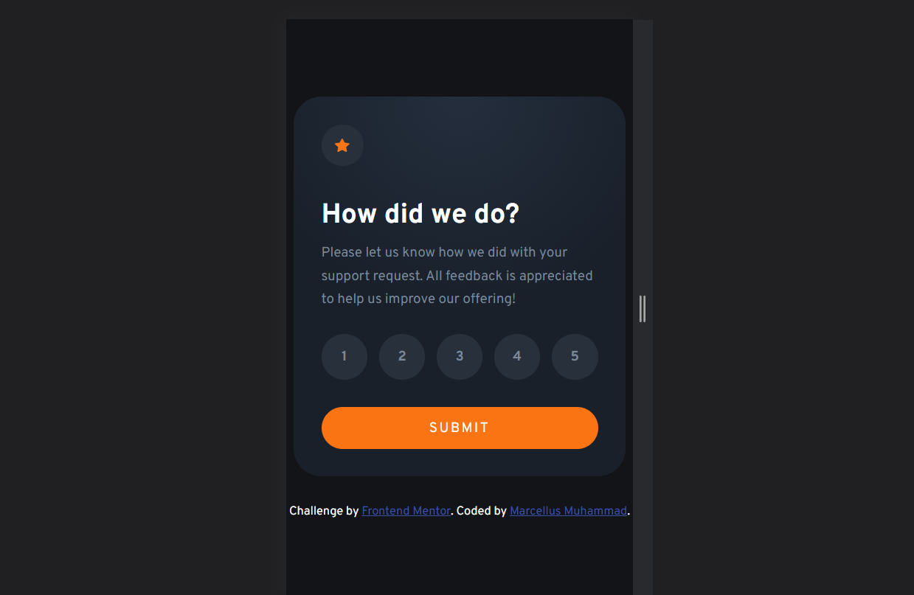

# Frontend Mentor - Interactive rating component solution

This is a solution to the [Interactive rating component challenge on Frontend Mentor](https://www.frontendmentor.io/challenges/interactive-rating-component-koxpeBUmI). Frontend Mentor challenges help you improve your coding skills by building realistic projects.

## Table of contents

- [Overview](#overview)
  - [The challenge](#the-challenge)
  - [Screenshot](#screenshot)
  - [Links](#links)
- [My process](#my-process)
  - [Built with](#built-with)
  - [Continued development](#continued-development)
  - [Useful resources](#useful-resources)
- [Author](#author)

## Overview

### The challenge

Users should be able to:

- View the optimal layout for the app depending on their device's screen size
- See hover states for all interactive elements on the page
- Select and submit a number rating
- See the "Thank you" card state after submitting a rating

### Screenshot

### Links

- Solution URL: [Github](https://github.com/Mtmuhammad/Interactive-rating-component)
- Live Site URL: [Netlify](https://interactive-ratingmtm.netlify.app/)

## My process

### Built with

- Semantic HTML5 markup
- Flexbox
- [Sass](https://sass-lang.com/) - For styles

### Continued development

Previously, I was knowledgeable of both linear and radial gradients and their respective usage in CSS. Although I am not completely comfortable with using radial gradients, I wish to use them more in my upcoming personal projects.

### Useful resources

- [CSS Gradient Generator](https://www.cssportal.com/css-gradient-generator/) - This site helped me grasp the concept on radial gradients and allowed for me to practice different techniques while creating them.

## Author

- Frontend Mentor - [@Mtmuhammad](https://www.frontendmentor.io/profile/Mtmuhammad)
